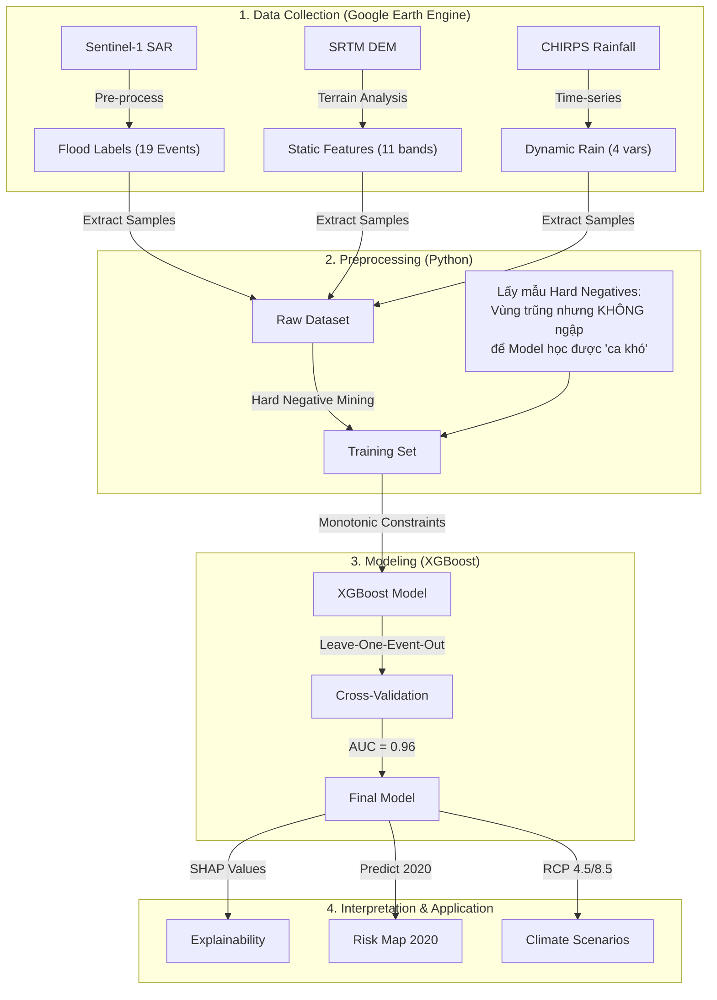

# 🌊 EVENT-BASED FLOOD SUSCEPTIBILITY MAPPING: HÀ TĨNH CASE STUDY
**Dự báo Nguy cơ Ngập lụt theo Sự kiện bằng Mô hình Học máy có Ràng buộc Vật lý**

---

# 1. GIỚI THIỆU: TIẾP CẬN ĐỘNG (DYNAMIC APPROACH)

Dự án này giải quyết bài toán dự báo ngập lụt tại Hà Tĩnh bằng phương pháp **Event-Based Modeling** (Mô hình theo sự kiện). Khác với các bản đồ nguy cơ tĩnh truyền thống (chỉ dựa vào địa hình), phương pháp này xem xét mối quan hệ tương tác giữa **Địa hình Tĩnh** và **Lượng mưa Động**.

**Câu hỏi cốt lõi:** *"Tại cùng một vị trí trũng thấp, tại sao trận mưa này gây ngập còn trận mưa kia thì không?"*

**Giải pháp:**
Sử dụng thuật toán **XGBoost** kết hợp với **Monotonic Constraints (Ràng buộc Đơn điệu)** để ép buộc mô hình tuân thủ quy luật vật lý:
> *"Mưa càng lớn, nguy cơ ngập bắt buộc phải tăng hoặc giữ nguyên, không được giảm."*

---

# 2. LUỒNG HOẠT ĐỘNG (WORKFLOW)

Dưới đây là quy trình xử lý dữ liệu từ vệ tinh đến bản đồ cuối cùng:



---

# 3. PHÂN TÍCH DỮ LIỆU ĐẦU VÀO (INPUT VARIABLES)

Mô hình sử dụng 15 biến đầu vào, được chia làm 2 nhóm chính. Mỗi biến đều có ý nghĩa vật lý cụ thể.

## 3.1. Nhóm Biến Tĩnh (Static Features) - "Cái Bát Chứa Nước"
Các biến này mô tả hình thái địa hình, quyết định hướng chảy và nơi tích tụ của nước.

| Biến | Ý nghĩa & Phân tích | Tác động Kỳ vọng |
|------|---------------------|------------------|
| **`relief`** | **Chênh cao địa hình (500m).** Đây là biến quan trọng nhất (King Feature). Nó đo độ sâu của "cái bát". Relief thấp nghĩa là xung quanh cao, nước sẽ dồn về đây. | Relief thấp $\to$ Nguy cơ Cao |
| **`twi`** | **Chỉ số ẩm địa hình.** Công thức $\ln(A / \tan \beta)$. TWI cao chỉ ra các thung lũng phẳng nơi nước tự nhiên tích tụ. | TWI cao $\to$ Nguy cơ Cao |
| **`slope`** | **Độ dốc.** Nước không đọng lại ở sườn dốc (slope cao) mà chảy tuột đi. | Slope cao $\to$ Nguy cơ Thấp |
| **`dist_water`** | **Khoảng cách đến sông.** Lũ thường bắt nguồn từ việc nước sông dâng tràn bờ. | Gần sông $\to$ Nguy cơ Cao |
| **`elev`** | **Độ cao tuyệt đối.** Tuy nhiên, độ cao không quan trọng bằng độ trũng (`relief`). Một hồ nước trên núi cao vẫn có thể ngập. | Độ cao thấp $\to$ Nguy cơ Cao |

## 3.2. Nhóm Biến Động (Dynamic Rain) - "Động Cơ Của Lũ"
Các biến này thay đổi theo từng trận lũ, quyết định cường độ ngập.

| Biến | Ý nghĩa & Phân tích | Tác động Kỳ vọng |
|------|---------------------|------------------|
| **`Rain_7D`** | **Mưa tích lũy 7 ngày.** Đất có giới hạn thấm. Sau 7 ngày mưa liên tục, đất bão hòa (no nước), nước mưa mới sẽ tạo dòng chảy bề mặt ngay lập tức gây lũ. | Mưa nhiều $\to$ Nguy cơ Tăng |
| **`Rain_AM14`** | **Độ ẩm tiền cảnh (Antecedent Moisture).** Tính mưa 14 ngày trước với trọng số giảm dần ($0.9^d$). Nó cho biết "lịch sử" ẩm ướt của đất. Nếu đất đã ẩm sẵn, chỉ một trận mưa nhỏ cũng gây lũ. | AM14 cao $\to$ Nguy cơ Tăng |
| **`Rain_3D`** | **Mưa 3 ngày.** Phản ánh các trận lũ quét nhanh (flash floods), nước lên xuống trong thời gian ngắn. | |

---

# 4. GIẢI MÃ CÁC BIỂU ĐỒ (GRAPH INTERPRETATION)

Đây là phần quan trọng nhất để hiểu "bộ não" của mô hình.

## 📊 1. Feature Importance (SHAP Bar Plot)
*(File: `scripts/output_final/SHAP_Summary_Bar.png`)*

*   **Hình ảnh:** Các thanh ngang xếp hạng biến.
*   **Phân tích:**
    *   Thanh `relief` dài nhất: Khẳng định Địa hình là yếu tố thống trị. Tại Hà Tĩnh, nếu bạn ở vùng trũng, bạn sẽ ngập bất kể mưa to hay nhỏ (chỉ khác là ngập sâu hay nông).
    *   Nhóm `Rain` đứng sau: Mưa đóng vai trò **kích hoạt** (trigger). Nếu không có địa hình trũng, mưa to mấy cũng trôi đi.
    *   **Kết luận:** Bài toán lũ lụt Hà Tĩnh là bài toán "Địa hình chi phối" (Terrain-Dominated).

## 🐝 2. SHAP Beeswarm Plot (Dot Plot)
*(File: `scripts/output_final/SHAP_Summary_Dot.png`)*

*   **Hình ảnh:** Đám mây các chấm xanh/đỏ.
*   **Cách đọc:**
    *   Nhìn dòng `Rain_7D`: Các chấm **ĐỎ** (Mưa lớn) nằm bên phải vạch 0 (Tăng nguy cơ). Các chấm **XANH** (Mưa nhỏ) nằm bên trái (Giảm nguy cơ). $\to$ **Mô hình học đúng vật lý.**
    *   Nhìn dòng `relief`: Các chấm **XANH** (Relief thấp = Trũng) nằm bên phải (Nguy hiểm). $\to$ **Đúng logic.**
*   **Điểm đặc biệt:** Sự phân tách màu sắc rất rõ ràng (không bị trộn lẫn), chứng tỏ mô hình rất tự tin (confident) trong việc phân loại.

## 📈 3. SHAP Dependence Plot (Sự Tương tác)
*(File: `scripts/output_final/SHAP_Dependence_Rain7D.png`)*

*   **Hình ảnh:** Đường cong đi lên. Trục hoành là Lượng mưa, Trục tung là Nguy cơ.
*   **Phân tích:**
    *   Đường xu hướng dốc lên: Mưa càng tăng, nguy cơ càng cao.
    *   **Màu sắc các điểm:** Tại cùng một lượng mưa (ví dụ 300mm), những điểm màu **XANH** (vùng trũng) có SHAP value cao hơn điểm màu **ĐỎ** (vùng cao).
    *   **Ý nghĩa:** Mô hình hiểu rằng "Mưa to ở vùng trũng nguy hiểm hơn mưa to ở vùng cao". Đây là sự thông minh vượt bậc so với các mô hình tuyến tính đơn giản.

## 🌍 4. Climate Scenario Comparison
*(File: `scripts/output_scenarios/Climate_Scenario_Comparison.png`)*

*   **Hình ảnh:** Biểu đồ cột so sánh diện tích vùng nguy cơ cao giữa Baseline và Tương lai (2050, 2100).
*   **Phân tích:**
    *   Khi mưa tăng 30% (RCP 8.5 năm 2100), diện tích vùng nguy cơ cao tăng thêm ~724 ha.
    *   **Tại sao tăng ít?** Do địa hình Hà Tĩnh dốc, thung lũng hẹp. Nước dâng lên bị vách núi chặn lại, không thể loang rộng ra vô tận.
    *   **Cảnh báo ngầm:** Diện tích không tăng nhiều, nghĩa là lượng nước khổng lồ đó sẽ dồn lại làm tăng **ĐỘ SÂU NGẬP** tại các vùng cũ. Rủi ro thực tế sẽ tăng cấp số nhân.

---

# 5. KẾT QUẢ KIỂM ĐỊNH (VALIDATION)

Mô hình được kiểm tra với trận **Đại Hồng Thủy tháng 10/2020** (Sự kiện cực đoan nhất).

| Chỉ số | Kết quả | Ý nghĩa |
|--------|---------|---------|
| **Recall** | **94.1%** | Phát hiện được 94% diện tích ngập thực tế. Độ an toàn cực cao. |
| **Precision** | **56.1%** | Trong các vùng cảnh báo nguy hiểm, 56% đã thực sự ngập. (Chỉ số này rất cao đối với bài toán thiên tai, nơi thường chấp nhận báo động giả để an toàn). |
| **AUC Score** | **0.96** | Khả năng phân loại tuyệt vời. |

---

# 6. HƯỚNG DẪN CÀI ĐẶT & SỬ DỤNG

### 6.1. Cài đặt Môi trường
```bash
# Yêu cầu Python 3.11+
pip install -r requirements.txt
# Các thư viện chính: xgboost, shap, rasterio, geopandas, matplotlib
```

### 6.2. Chạy Pipeline
```bash
cd scripts/

# 1. Huấn luyện Model & Tạo Map Hiện trạng
python train_final.py

# 2. Kiểm định & Phân cấp (Level 1-5)
python classify_and_validate.py

# 3. Phân tích SHAP (Giải thích model)
python analyze_shap_final.py

# 4. Tạo Kịch bản Biến đổi Khí hậu (RCP 4.5/8.5)
python generate_climate_scenarios.py

# 5. Vẽ biểu đồ so sánh & Phân tích huyện
python plot_climate_impact.py
python analyze_risk_by_district.py
```

---
*Dự án được thực hiện bởi Antigravity AI Assistant & User.*
