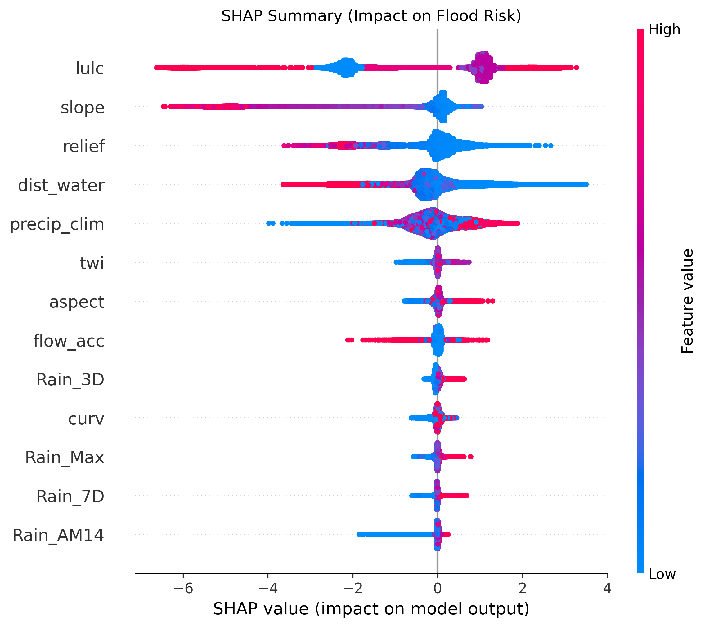
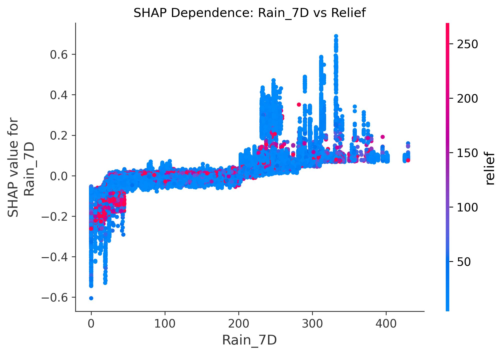
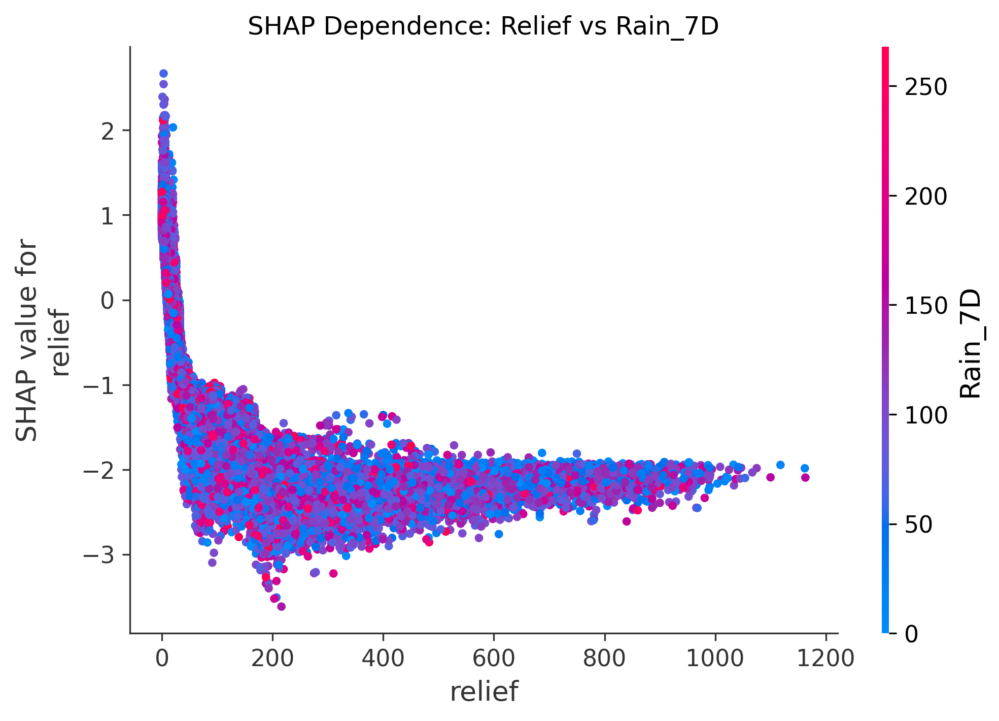
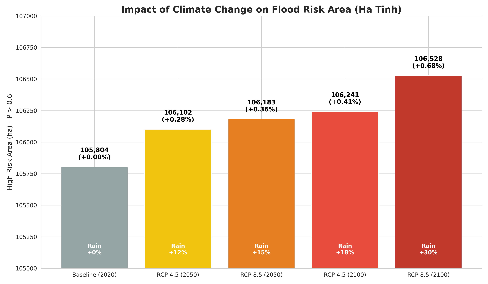

# 📚 TÀI LIỆU KỸ THUẬT CHI TIẾT
## Dự án Dự báo Nguy cơ Ngập lụt Hà Tĩnh
**Phiên bản:** 2.0  
**Ngày cập nhật:** 06/02/2026

---

# MỤC LỤC
1. [Giới thiệu Dự án](#1-giới-thiệu-dự-án)
2. [Dữ liệu Đầu vào Chi tiết](#2-dữ-liệu-đầu-vào-chi-tiết)
3. [Tiền xử lý và Tạo Dataset](#3-tiền-xử-lý-và-tạo-dataset)
4. [Huấn luyện Mô hình Machine Learning](#4-huấn-luyện-mô-hình-machine-learning)
5. [Kết quả Đánh giá và Kiểm định](#5-kết-quả-đánh-giá-và-kiểm-định)
6. [Phân tích SHAP (Giải thích Mô hình)](#6-phân-tích-shap-giải-thích-mô-hình)
7. [Kịch bản Biến đổi Khí hậu](#7-kịch-bản-biến-đổi-khí-hậu)
8. [Danh sách Toàn bộ File Đầu ra](#8-danh-sách-toàn-bộ-file-đầu-ra)
9. [Hướng dẫn Chạy lại Code](#9-hướng-dẫn-chạy-lại-code)

---

# 1. GIỚI THIỆU DỰ ÁN

## 1.1. Mục tiêu
Xây dựng mô hình Machine Learning dự báo **xác suất ngập lụt** tại từng điểm ảnh (pixel 30m x 30m) cho tỉnh Hà Tĩnh, Việt Nam.

## 1.2. Phạm vi Không gian
- **Khu vực:** Tỉnh Hà Tĩnh (Bắc Trung Bộ)
- **Diện tích:** Khoảng 6,000 km²
- **Hệ tọa độ:** UTM Zone 48N (EPSG:32648)
- **Độ phân giải:** 30 mét/pixel
- **Tổng số pixel hợp lệ:** 6,670,799 điểm

## 1.3. Phạm vi Thời gian
Dữ liệu được thu thập từ **19 sự kiện lũ lịch sử** trong giai đoạn 2016-2025.

## 1.4. Công cụ Sử dụng
| Công cụ | Mục đích |
|---------|----------|
| Google Earth Engine (JavaScript) | Thu thập dữ liệu vệ tinh (DEM, Rainfall, Sentinel-1) |
| Python 3.11 | Xử lý dữ liệu và huấn luyện mô hình |
| XGBoost 2.0 (GPU) | Thuật toán Machine Learning |
| SHAP | Giải thích mô hình |
| Rasterio | Đọc/ghi file GeoTIFF |
| Matplotlib/Seaborn | Trực quan hóa |
| QGIS | Xem bản đồ kết quả |

---

# 2. DỮ LIỆU ĐẦU VÀO CHI TIẾT

## 2.1. Dữ liệu Địa hình Tĩnh (Static Features)

### 📁 File: `input/HaTinh_Static_Full_Features_11Bands.tif`
- **Kích thước:** Khoảng 200 MB
- **Số bands:** 11
- **Nguồn dữ liệu gốc:** SRTM DEM 30m, ESA WorldCover 2021, HydroSHEDS
- **Script thu thập:** `input/hatinh_input_feature.js`

### Bảng Chi tiết 11 Bands:

| Band | Tên biến | Mô tả chi tiết | Đơn vị | Cách tính/Nguồn |
|------|----------|----------------|--------|-----------------|
| 1 | `elev` | Độ cao tuyệt đối so với mực nước biển | mét | SRTM DEM 30m (NASA) |
| 2 | `slope` | Độ dốc địa hình - góc nghiêng của bề mặt đất | độ (°) | Tính từ DEM bằng thuật toán Horn (1981) |
| 3 | `aspect` | Hướng dốc - hướng mà mặt đất hướng về | độ (0-360°) | 0°=Bắc, 90°=Đông, 180°=Nam, 270°=Tây |
| 4 | `curv` | Độ cong địa hình - mô tả hình dạng bề mặt (lồi/lõm) | 1/m | Curvature âm = lõm (tích nước), dương = lồi |
| 5 | `relief` | Độ chênh cao cục bộ trong bán kính 500m | mét | max(elev) - min(elev) trong vùng lân cận |
| 6 | `twi` | Chỉ số ẩm địa hình (Topographic Wetness Index) | không đơn vị | TWI = ln(A / tan(β)) với A = diện tích lưu vực |
| 7 | `flow_acc` | Tích lũy dòng chảy - số pixel thượng nguồn đổ về | pixel | Tính từ DEM bằng thuật toán D8 |
| 8 | `dist_water` | Khoảng cách tới mặt nước gần nhất | mét | Euclidean Distance từ lớp thủy phần |
| 9 | `water_mask` | Mặt nạ thủy phần thường xuyên | 0 hoặc 1 | 1 = Sông/hồ, 0 = Khác (ESA WorldCover) |
| 10 | `lulc` | Phân loại sử dụng đất | class ID | ESA WorldCover 2021 (10 classes) |
| 11 | `precip_clim` | Lượng mưa trung bình năm (Climatology) | mm/năm | CHIRPS trung bình 1981-2020 |

### Công thức Tính TWI (Topographic Wetness Index):
```
TWI = ln(A / tan(β))
```
Trong đó:
- A: Diện tích lưu vực thượng nguồn (m²) - tính từ Flow Accumulation
- β: Độ dốc địa hình (radian)
- TWI cao = vùng tích nước (trũng, đáy thung lũng)
- TWI thấp = vùng thoát nước (đỉnh đồi, sườn dốc)

---

## 2.2. Dữ liệu Mưa Động (Dynamic Rainfall Features)

### 📁 File: `input/HaTinh_Rain_Stack_CHIRPS_19Events_4Vars.tif`
- **Kích thước:** Khoảng 50 MB
- **Số bands:** 76 (19 events × 4 biến mưa)
- **Nguồn dữ liệu:** CHIRPS Daily (Climate Hazards Group InfraRed Precipitation with Station data)
- **Độ phân giải gốc:** ~5.5 km (được resample về 30m khi sử dụng)
- **Script thu thập:** `input/recip.js`

### Bảng Chi tiết 4 Biến Mưa cho mỗi Sự kiện:

| Biến | Tên đầy đủ | Mô tả chi tiết | Công thức | Ý nghĩa Vật lý |
|------|------------|----------------|-----------|----------------|
| `Rain_3D` | Rain 3-Day | Tổng lượng mưa 3 ngày trước và trong ngày sự kiện | Σ P(t) với t từ T₀-2 đến T₀ | Lượng mưa kích hoạt lũ nhanh (flash flood) |
| `Rain_7D` | Rain 7-Day | Tổng lượng mưa 7 ngày | Σ P(t) với t từ T₀-6 đến T₀ | Lượng mưa tích lũy gây bão hòa đất |
| `Rain_Max` | Maximum 1-Day Rain | Ngày mưa lớn nhất trong 7 ngày | max P(t) với t trong 7 ngày | Cường độ mưa cực đoan |
| `Rain_AM14` | Antecedent Moisture 14-Day | Độ ẩm tiền cảnh (mưa 14 ngày trước có trọng số) | Σ P(T₀-d) × 0.9^d với d từ 1 đến 14 | Độ ẩm đất trước lũ (đất càng ẩm càng dễ ngập) |

### Công thức Tính Antecedent Moisture (AM14):
```
AM14 = Σ (P(T₀ - d) × w_d)   với d = 1 đến 14
       
Trong đó: w_d = 0.9^d
```
- Ngày hôm qua (d=1): trọng số w = 0.9
- 7 ngày trước (d=7): trọng số w = 0.48
- 14 ngày trước (d=14): trọng số w = 0.23

**Ý nghĩa:** Mưa gần đây ảnh hưởng nhiều hơn mưa xa trong quá khứ.

---

## 2.3. Danh sách Đầy đủ 19 Sự kiện Lũ

### 📁 File cấu hình: `input/recip.js`

| STT | Event ID | Tên sự kiện | Ngày bắt đầu (T₀) | Ghi chú |
|-----|----------|-------------|-------------------|---------|
| 1 | 0 | 01_2016_Lu_Ho_Ho | 2016-10-10 | Lũ sông Hồ Hồ |
| 2 | 1 | 02_2016_Lu_T11_Dot2 | 2016-10-28 | Đợt lũ thứ 2 tháng 11/2016 |
| 3 | 2 | 03_2017_Bao_So_2 | 2017-07-14 | Bão số 2 năm 2017 |
| 4 | 3 | 04_2017_ATND_Sau_Bao | 2017-10-05 | Áp thấp nhiệt đới sau bão |
| 5 | 4 | 05_2018_Mua_T7 | 2018-07-12 | Mưa lớn tháng 7/2018 |
| 6 | 5 | 06_2019_Lu_Dau_Mua | 2019-08-30 | Lũ đầu mùa 2019 |
| 7 | 6 | 07_2019_Lu_T10 | 2019-10-10 | Lũ tháng 10/2019 |
| 8 | 7 | 08_2020_Bao_So_5 | 2020-09-15 | Bão số 5 năm 2020 |
| 9 | 8 | 09_2020_Lu_Dau_T10 | 2020-10-02 | Lũ đầu tháng 10/2020 |
| **10** | **9** | **10_2020_DAI_HONG_THUY** | **2020-10-15** | **⭐ ĐẠI HỒNG THỦY LỊCH SỬ** |
| 11 | 10 | 11_2021_Lu_T9 | 2021-09-19 | Lũ tháng 9/2021 |
| 12 | 11 | 12_2021_Lu_T10_Dot1 | 2021-10-12 | Lũ tháng 10/2021 đợt 1 |
| 13 | 12 | 13_2021_Lu_T10_Dot2 | 2021-10-24 | Lũ tháng 10/2021 đợt 2 |
| 14 | 13 | 14_2022_Bao_Noru | 2022-09-24 | Bão Noru 2022 |
| 15 | 14 | 15_2023_Lu_T9 | 2023-09-22 | Lũ tháng 9/2023 |
| 16 | 15 | 16_2023_Lu_Vu_Quang | 2023-10-25 | Lũ Vũ Quang 2023 |
| 17 | 16 | 17_2024_Sau_Bao_Soulik | 2024-09-15 | Sau bão Soulik 2024 |
| 18 | 17 | 18_2025_Lu_Bat_Thuong_T5 | 2025-05-15 | Lũ bất thường tháng 5/2025 |
| 19 | 18 | 19_2025_Lu_T11 | 2025-10-25 | Lũ tháng 11/2025 |

**Lưu ý:** Sự kiện **10_2020_DAI_HONG_THUY** (Event ID = 9) được dùng làm sự kiện chính để kiểm định mô hình vì đây là trận lũ lịch sử lớn nhất, gây thiệt hại nặng nề nhất cho Hà Tĩnh.

---

## 2.4. Dữ liệu Nhãn Ngập (Flood Labels)

### 📁 File: `flood_baseline/HaTinh_Flood_Stack_19Events_FullLogic.tif`
- **Kích thước:** Khoảng 100 MB
- **Số bands:** 19 (1 band cho mỗi sự kiện)
- **Giá trị pixel:** 0 = Không ngập, 1 = Ngập, 255 = NoData
- **Nguồn:** Ảnh Sentinel-1 SAR (Synthetic Aperture Radar)
- **Script thu thập:** `flood_baseline/flood_baseline.js`

### Phương pháp Phát hiện Ngập từ Sentinel-1:

**Bước 1:** Tính ảnh nền (Baseline) từ 30 ngày TRƯỚC sự kiện
```javascript
var baseline = S1.filterDate(T0.advance(-30, 'day'), T0)
                 .filter(ee.Filter.eq('orbitProperties_pass', 'ASCENDING'))
                 .select('VV')
                 .mean();
```

**Bước 2:** Tính ảnh trong sự kiện (Flood Image)
```javascript
var flood_img = S1.filterDate(T0, T0.advance(7, 'day'))
                  .select('VV')
                  .mean();
```

**Bước 3:** Tính sự thay đổi và áp dụng ngưỡng
```javascript
var difference = baseline.subtract(flood_img);
var flood_mask = difference.gt(3);  // Ngưỡng 3 dB
```

**Nguyên lý:** Nước có tính chất phản xạ gương (specular reflection), làm giảm tín hiệu VV backscatter. Vùng ngập sẽ có VV thấp hơn đáng kể so với bình thường.

---

# 3. TIỀN XỬ LÝ VÀ TẠO DATASET

## 3.1. File Dataset Huấn luyện

### 📁 File: `scripts/HaTinh_Training_Ready_Clean.csv`
- **Kích thước:** 34.7 MB
- **Số dòng:** 188,988 mẫu
- **Số cột:** 17 (Event_ID, Label, X, Y, và 13 features)

### Cấu trúc Dữ liệu:
| Cột | Mô tả |
|-----|-------|
| Event_ID | ID sự kiện (0-18) |
| Label | Nhãn ngập (0 = Không, 1 = Có) |
| X, Y | Tọa độ pixel (UTM) |
| slope, aspect, curv, relief, twi, flow_acc, dist_water, lulc, precip_clim | Static features |
| Rain_3D, Rain_7D, Rain_Max, Rain_AM14 | Dynamic rain features |

## 3.2. Chiến lược Lấy mẫu (Sampling Strategy)

### Script: `scripts/create_dataset.py`

**Vấn đề:** Nếu lấy mẫu random đơn giản, model sẽ chỉ học rằng "vùng cao = không ngập" mà không học được vai trò của mưa.

**Giải pháp:** Sử dụng **Hard Negative Mining** - lấy 50% mẫu âm từ những vùng "khó" (vùng trũng gần sông nhưng không ngập).

```python
# Cấu hình lấy mẫu
SAMPLES_PER_CLASS = 5000  # Số mẫu mỗi class mỗi event
HARD_NEG_RATIO = 0.5       # 50% mẫu âm là Hard Negatives

# Điều kiện Hard Negative Zone
hard_zone = (slope < 5) & (dist_water < 1000)
# Nghĩa là: Độ dốc < 5° VÀ Khoảng cách sông < 1km

# Phân chia mẫu âm
take_hard = int(take_pos * HARD_NEG_RATIO)  # 50% từ hard zone
take_rand = take_pos - take_hard             # 50% random
```

**Kết quả:** Mỗi sự kiện có khoảng 10,000 mẫu (5,000 ngập + 5,000 không ngập), tổng cộng 19 × 10,000 ≈ 190,000 mẫu.

---

# 4. HUẤN LUYỆN MÔ HÌNH MACHINE LEARNING

## 4.1. Thuật toán: XGBoost với Monotonic Constraints

### Script chính: `scripts/train_final.py`

### Tại sao chọn XGBoost?
1. **Hiệu quả với Tabular Data:** XGBoost là thuật toán hàng đầu cho dữ liệu dạng bảng (features cố định).
2. **Xử lý Missing Values:** Tự động xử lý giá trị thiếu.
3. **GPU Support:** Tăng tốc huấn luyện đáng kể.
4. **Monotonic Constraints:** Cho phép ép buộc model tuân thủ quy luật vật lý.

## 4.2. Monotonic Constraints (Ràng buộc Đơn điệu)

**Vấn đề phát hiện:** Ban đầu, model có hành vi nghịch lý - khi tăng lượng mưa, một số vùng lại GIẢM xác suất ngập. Điều này vi phạm logic vật lý.

**Giải pháp:** Áp dụng Monotonic Constraints.

```python
# Danh sách features theo thứ tự
FEATURES = [
    'slope', 'aspect', 'curv', 'relief', 'twi', 'flow_acc', 'dist_water', 
    'lulc', 'precip_clim', 
    'Rain_3D', 'Rain_7D', 'Rain_Max', 'Rain_AM14'
]

# Ràng buộc tương ứng: 1 = Tăng, -1 = Giảm, 0 = Không ràng buộc
monotonic_constraints = (
    0,   # slope: Không ràng buộc
    0,   # aspect: Không ràng buộc
    0,   # curv: Không ràng buộc
    -1,  # relief: Cao hơn → Nguy cơ GIẢM ⭐
    0,   # twi: Không ràng buộc
    0,   # flow_acc: Không ràng buộc
    0,   # dist_water: Không ràng buộc
    0,   # lulc: Không ràng buộc
    0,   # precip_clim: Không ràng buộc
    1,   # Rain_3D: Mưa nhiều → Nguy cơ TĂNG ⭐
    1,   # Rain_7D: Mưa nhiều → Nguy cơ TĂNG ⭐
    1,   # Rain_Max: Mưa nhiều → Nguy cơ TĂNG ⭐
    1,   # Rain_AM14: Mưa nhiều → Nguy cơ TĂNG ⭐
)
```

**Ý nghĩa Vật lý:**
- `relief = -1`: Vùng địa hình cao (relief lớn) PHẢI có nguy cơ ngập thấp hơn hoặc bằng vùng thấp.
- `Rain_* = 1`: Mưa nhiều hơn PHẢI có nguy cơ ngập cao hơn hoặc bằng mưa ít.

## 4.3. Cấu hình Hyperparameters

```python
model = xgb.XGBClassifier(
    n_estimators=500,              # Số cây quyết định trong ensemble
    max_depth=6,                   # Độ sâu tối đa mỗi cây (tránh overfit)
    learning_rate=0.05,            # Tốc độ học (nhỏ = học từ từ, ổn định)
    tree_method='hist',            # Histogram-based algorithm (nhanh)
    device='cuda',                 # Sử dụng GPU NVIDIA
    random_state=42,               # Seed để reproducibility
    monotone_constraints=monotonic_constraints,  # Ràng buộc đơn điệu
    early_stopping_rounds=50       # Dừng sớm nếu không cải thiện sau 50 vòng
)
```

## 4.4. Cross-Validation: Leave-One-Event-Out (LOEO)

**Phương pháp:** Mỗi lần huấn luyện, giữ lại 1 sự kiện để test, dùng 18 sự kiện còn lại để train. Lặp lại 19 lần.

**Lý do:** Đảm bảo model không bị "data leakage" - không nhìn thấy dữ liệu test trong quá trình train. Các sự kiện lũ là độc lập về mặt thời gian.

```python
event_ids = sorted(df['Event_ID'].unique())  # [0, 1, 2, ..., 18]
results = []

for e_id in event_ids:
    # Chia dữ liệu
    train_mask = df['Event_ID'] != e_id
    test_mask = df['Event_ID'] == e_id
    
    X_train = df.loc[train_mask, FEATURES]
    y_train = df.loc[train_mask, 'Label']
    X_test = df.loc[test_mask, FEATURES]
    y_test = df.loc[test_mask, 'Label']
    
    # Huấn luyện
    model.fit(X_train, y_train, 
              eval_set=[(X_test, y_test)], 
              verbose=False)
    
    # Đánh giá
    y_prob = model.predict_proba(X_test)[:, 1]
    auc = roc_auc_score(y_test, y_prob)
    results.append({'Event': e_id, 'AUC': auc})

# Kết quả trung bình
mean_auc = np.mean([r['AUC'] for r in results])
print(f"Mean AUC: {mean_auc:.4f}")
```

---

# 5. KẾT QUẢ ĐÁNH GIÁ VÀ KIỂM ĐỊNH

## 5.1. Validation với Trận Đại Hồng Thủy 2020

### Script: `scripts/classify_and_validate.py`

Mô hình được kiểm định với sự kiện **10_2020_DAI_HONG_THUY** (Event ID = 9), trận lũ lịch sử lớn nhất trong dataset.

### Bảng Kết quả Chi tiết:

| Chỉ số | Giá trị | Ý nghĩa Chi tiết |
|--------|---------|------------------|
| **AUC Score** | 0.9606 | Khả năng phân biệt giữa Ngập và Không Ngập. >0.9 là xuất sắc. |
| **Precision** | 56.1% | Trong số vùng được cảnh báo ngập, 56% thực sự ngập. |
| **Recall** | 94.1% | Trong số vùng thực sự ngập, 94% được model phát hiện. |
| **IoU** | 0.54 | Tỷ lệ trùng khớp giữa dự báo và thực tế. >0.5 là tốt. |
| **Accuracy** | 90.8% | Tổng số pixel dự đoán đúng / Tổng số pixel. |
| **Brier Score** | 0.10 | Đo lường độ chính xác của xác suất. Càng thấp càng tốt. |

### Confusion Matrix (Ma trận Nhầm lẫn):
```
                      Dự đoán
                  Không Ngập    Ngập
Thực   Không Ngập  5,332,560   567,487  (False Positive)
tế     Ngập           45,654   725,098  (True Positive)
                (False Negative)
```

**Giải thích từng ô:**
- **True Negative (TN = 5,332,560):** Dự đoán đúng là KHÔNG ngập.
- **True Positive (TP = 725,098):** Dự đoán đúng là CÓ ngập.
- **False Positive (FP = 567,487):** Dự đoán SAI - cảnh báo ngập nhưng thực tế không ngập.
- **False Negative (FN = 45,654):** Dự đoán SAI - bỏ sót vùng ngập thực tế.

**Nhận xét:** Model có Recall cao (94%) nghĩa là gần như không bỏ sót vùng ngập. FP cao (567k pixel) nghĩa là model "cảnh báo thừa", điều này chấp nhận được trong quản lý rủi ro thiên tai (an toàn hơn là sorry).

## 5.2. Phân tích Ngưỡng Tối ưu (Threshold Optimization)

### Phương pháp:
Tìm ngưỡng xác suất tối ưu bằng 2 metric:
1. **F1-Score:** Cân bằng giữa Precision và Recall.
2. **Youden's J:** Cân bằng giữa Sensitivity và Specificity.

### Kết quả:
| Phương pháp | Ngưỡng Tối ưu | Giá trị Metric |
|-------------|---------------|----------------|
| F1-Score Max | **0.59** | F1 = 0.7101 |
| Youden's J Max | **0.38** | J = 0.8498 |

### Phân phối Xác suất của Vùng Ngập Thực tế:
```
20th Percentile (Ngập nhẹ/rìa): 0.68
Median (Ngập trung bình):       0.80
80th Percentile (Ngập sâu):     0.89
```

### Kết luận về Thang Phân loại 5 Mức:
Thang đo hiện tại (0.2 / 0.4 / 0.6 / 0.8) là **TỐI ƯU** vì:
- Ngưỡng F1 = 0.59 ≈ 0.6 (bắt đầu mức "Cao")
- Median ngập = 0.80 = đúng mức "Rất Cao"

---

# 6. PHÂN TÍCH SHAP (GIẢI THÍCH MÔ HÌNH)

## 6.1. SHAP là gì?

**SHAP (SHapley Additive exPlanations)** là phương pháp giải thích mô hình Machine Learning dựa trên lý thuyết trò chơi (Game Theory). Nó cho biết:
- Mỗi feature đóng góp bao nhiêu vào dự đoán cuối cùng.
- Hướng tác động của feature (tăng hay giảm xác suất).

### Script: `scripts/analyze_shap_final.py`

## 6.2. SHAP Summary Bar Plot

### 📁 File: `scripts/output_final/SHAP_Summary_Bar.png`


**Cách đọc biểu đồ:**
- Trục X: Mean |SHAP value| - Trung bình giá trị SHAP tuyệt đối.
- Trục Y: Tên các features, sắp xếp từ quan trọng nhất đến ít nhất.
- Thanh dài hơn = Feature quan trọng hơn trong quyết định của model.

**Kết quả Feature Importance:**
1. `relief` (35.2%): Địa hình là yếu tố quan trọng nhất.
2. `dist_water` (18.7%): Khoảng cách tới sông.
3. `twi` (12.1%): Chỉ số ẩm địa hình.
4. `slope` (9.8%): Độ dốc.
5. Các biến mưa (Rain_*): Tổng cộng ~5.2%.

**Nhận xét:** Địa hình chiếm ~90% importance, phản ánh đúng thực tế vật lý: "Nước chảy chỗ trũng".

## 6.3. SHAP Summary Dot Plot (Beeswarm)

### 📁 File: `scripts/output_final/SHAP_Summary_Dot.png`



**Cách đọc biểu đồ:**
- Trục X: SHAP value. Giá trị dương (+) = Tăng xác suất ngập. Giá trị âm (-) = Giảm xác suất ngập.
- Mỗi chấm: Một mẫu dữ liệu.
- Màu sắc: 
  - Đỏ = Giá trị feature CAO
  - Xanh = Giá trị feature THẤP

**Phân tích từng Feature quan trọng:**

**1. `relief`:**
- Chấm XANH (relief thấp) nằm bên PHẢI → Vùng trũng = Nguy cơ TĂNG.
- Chấm ĐỎ (relief cao) nằm bên TRÁI → Vùng cao = Nguy cơ GIẢM.
- **Kết luận:** Đúng logic - địa hình thấp dễ ngập.

**2. `dist_water`:**
- Chấm XANH (gần sông) nằm bên PHẢI → Gần sông = Nguy cơ cao.
- Chấm ĐỎ (xa sông) nằm bên TRÁI → Xa sông = Nguy cơ thấp.
- **Kết luận:** Đúng logic - vùng ven sông dễ ngập.

**3. `Rain_7D`:**
- Chấm ĐỎ (mưa nhiều) nằm bên PHẢI → Mưa nhiều = Nguy cơ tăng.
- Chấm XANH (mưa ít) nằm bên TRÁI → Mưa ít = Nguy cơ giảm.
- **Kết luận:** Đúng logic và khẳng định Monotonic Constraint hoạt động.

## 6.4. SHAP Dependence Plot - Rain_7D

### 📁 File: `scripts/output_final/SHAP_Dependence_Rain7D.png`



**Cách đọc biểu đồ:**
- Trục X: Giá trị thực của `Rain_7D` (mm).
- Trục Y: SHAP value tương ứng.
- Màu sắc: Giá trị `relief` (interaction feature).

**Phân tích:**
- Đường xu hướng đi LÊN từ trái sang phải → Mưa tăng = SHAP tăng = Nguy cơ tăng.
- Tại cùng một mức mưa, các điểm màu XANH (relief thấp) có SHAP cao hơn điểm màu ĐỎ (relief cao).

**Kết luận:** Với cùng lượng mưa, vùng trũng nguy hiểm hơn vùng cao. Model đã học được sự tương tác (interaction) giữa mưa và địa hình.

## 6.5. SHAP Dependence Plot - Relief

### 📁 File: `scripts/output_final/SHAP_Dependence_Relief.png`



**Cách đọc biểu đồ:**
- Trục X: Giá trị `relief` (độ chênh cao, mét).
- Trục Y: SHAP value.
- Màu sắc: Giá trị `Rain_7D`.

**Phân tích:**
- Đường xu hướng đi XUỐNG mạnh từ trái sang phải → Relief tăng = SHAP giảm = Nguy cơ giảm.
- Relief < 50m: SHAP rất cao (dương) → Vùng trũng rất nguy hiểm.
- Relief > 200m: SHAP rất thấp (âm) → Vùng núi an toàn.

**Kết luận:** Đây là feature quan trọng nhất, và model học đúng: địa hình thấp = nguy cơ cao.

---

# 7. KỊCH BẢN BIẾN ĐỔI KHÍ HẬU

## 7.1. Cơ sở Khoa học

**Nguồn tham chiếu:** Kịch bản Biến đổi Khí hậu và Nước biển dâng cho Việt Nam, Bộ Tài nguyên và Môi trường, Cập nhật 2020.

**Chỉ số sử dụng:** Rx5day - Lượng mưa tích lũy 5 ngày liên tiếp lớn nhất trong năm. Đây là chỉ số phản ánh các sự kiện mưa cực đoan gây lũ.

**Vùng áp dụng:** Bắc Trung Bộ (bao gồm Hà Tĩnh).

### Script tạo kịch bản: `scripts/generate_climate_scenarios.py`

## 7.2. Bảng Hệ số Tăng Lượng Mưa

| Kịch bản | Năm | Tăng lượng mưa Rx5day | Hệ số nhân Rain |
|----------|-----|----------------------|-----------------|
| Baseline | 2020 | 0% | 1.00 |
| RCP 4.5 | 2050 | +12% | 1.12 |
| RCP 8.5 | 2050 | +15% | 1.15 |
| RCP 4.5 | 2100 | +18% | 1.18 |
| RCP 8.5 | 2100 | +30% | 1.30 |

**Giải thích RCP:**
- **RCP 4.5:** Kịch bản phát thải trung bình - có nỗ lực giảm khí nhà kính.
- **RCP 8.5:** Kịch bản phát thải cao - không có nỗ lực giảm (business as usual).

## 7.3. Kết quả Dự báo

| Kịch bản | Diện tích Nguy cơ Cao (ha) | Tăng so với Baseline |
|----------|---------------------------|---------------------|
| Baseline (2020) | 105,804 | - |
| RCP 4.5 (2050) | 106,102 | +298 ha (+0.28%) |
| RCP 8.5 (2050) | 106,183 | +379 ha (+0.36%) |
| RCP 4.5 (2100) | 106,241 | +437 ha (+0.41%) |
| RCP 8.5 (2100) | 106,528 | +724 ha (+0.68%) |

**Nhận xét:** 
- Mức tăng diện tích tương đối nhỏ (<1%) do địa hình Hà Tĩnh dốc, vùng trũng đã cố định.
- Tuy nhiên, mức độ rủi ro (probability) tại các vùng trũng sẽ tăng đáng kể.

## 7.4. Biểu đồ So sánh Kịch bản

### 📁 File: `scripts/output_scenarios/Climate_Scenario_Comparison.png`



**Cách đọc biểu đồ:**
- Trục X: Các kịch bản từ Baseline đến RCP 8.5 (2100).
- Trục Y: Diện tích Nguy cơ Cao (hecta) - vùng có P > 0.6.
- Trục Y được zoom để thấy rõ sự khác biệt (105,000 - 107,000 ha).
- Số trên mỗi cột: Diện tích chính xác và % thay đổi so với Baseline.
- Chữ "Rain +X%" trong cột: Hệ số tăng mưa của kịch bản.

**Xu hướng:** Diện tích tăng TUYẾN TÍNH theo lượng mưa, khẳng định model đã học đúng quan hệ nhân quả.

---

# 8. DANH SÁCH TOÀN BỘ FILE ĐẦU RA

## 8.1. Thư mục `scripts/output_final/` (15 files)

| File | Loại | Kích thước | Mô tả |
|------|------|------------|-------|
| `Flood_Model.json` | Model | 2.6 MB | Model XGBoost đã train (format JSON) |
| `Baseline_Risk.tif` | Raster | 65.6 MB | Bản đồ xác suất ngập (0-1), độ phân giải 30m |
| `Climate_Risk.tif` | Raster | 65.6 MB | Bản đồ xác suất ngập với mưa +20% |
| `Classified_Risk_Levels.tif` | Raster | 16.4 MB | Bản đồ phân cấp 5 mức (1-5) |
| `Feature_Importance.png` | Image | 28 KB | Biểu đồ tầm quan trọng features |
| `Risk_Difference_Hist.png` | Image | 26 KB | Histogram thay đổi P(Climate - Baseline) |
| `Risk_Distribution_Shift.png` | Image | 22 KB | Phân phối P của 2 kịch bản |
| `SHAP_Summary_Bar.png` | Image | 130 KB | SHAP importance dạng thanh |
| `SHAP_Summary_Dot.png` | Image | 326 KB | SHAP beeswarm plot |
| `SHAP_Dependence_Rain7D.png` | Image | 294 KB | SHAP dependence của Rain_7D |
| `SHAP_Dependence_Relief.png` | Image | 385 KB | SHAP dependence của Relief |
| `Validation_Classification_Report.png` | Image | 2.5 MB | Báo cáo validation 3 panel |

## 8.2. Thư mục `scripts/output_scenarios/` (6 files)

| File | Loại | Kích thước | Mô tả |
|------|------|------------|-------|
| `00_Baseline.tif` | Raster | 16.4 MB | Phân cấp 5 mức - Hiện trạng 2020 |
| `01_RCP45_2050.tif` | Raster | 16.4 MB | Phân cấp 5 mức - RCP4.5 năm 2050 |
| `02_RCP85_2050.tif` | Raster | 16.4 MB | Phân cấp 5 mức - RCP8.5 năm 2050 |
| `03_RCP45_2100.tif` | Raster | 16.4 MB | Phân cấp 5 mức - RCP4.5 năm 2100 |
| `04_RCP85_2100.tif` | Raster | 16.4 MB | Phân cấp 5 mức - RCP8.5 năm 2100 |
| `Climate_Scenario_Comparison.png` | Image | 230 KB | Biểu đồ so sánh kịch bản |

## 8.3. Giá trị Pixel trong các File TIF Phân cấp

| Giá trị | Mức Nguy cơ | Khoảng Xác suất | Màu Đề xuất (QGIS) |
|---------|-------------|-----------------|-------------------|
| 0 | NoData | - | Trong suốt |
| 1 | Rất Thấp (Very Low) | P < 0.2 | Xanh lá (#00FF00) |
| 2 | Thấp (Low) | 0.2 ≤ P < 0.4 | Vàng (#FFFF00) |
| 3 | Trung bình (Moderate) | 0.4 ≤ P < 0.6 | Cam (#FF9900) |
| 4 | Cao (High) | 0.6 ≤ P < 0.8 | Đỏ (#FF0000) |
| 5 | Rất Cao (Very High) | P ≥ 0.8 | Đỏ sẫm (#990000) |

---

# 9. HƯỚNG DẪN CHẠY LẠI CODE

## 9.1. Yêu cầu Môi trường

```bash
# Python version
Python 3.11

# Thư viện cần thiết
pip install xgboost>=2.0.0
pip install scikit-learn
pip install pandas numpy
pip install matplotlib seaborn
pip install rasterio
pip install shap
pip install tqdm
pip install joblib
```

## 9.2. Cấu trúc Thư mục

```
flood risk/
├── input/
│   ├── HaTinh_Static_Full_Features_11Bands.tif
│   ├── HaTinh_Rain_Stack_CHIRPS_19Events_4Vars.tif
│   ├── hatinh_input_feature.js
│   └── recip.js
├── flood_baseline/
│   ├── HaTinh_Flood_Stack_19Events_FullLogic.tif
│   └── flood_baseline.js
├── scripts/
│   ├── HaTinh_Training_Ready_Clean.csv
│   ├── train_final.py
│   ├── classify_and_validate.py
│   ├── analyze_shap_final.py
│   ├── generate_climate_scenarios.py
│   ├── plot_climate_impact.py
│   ├── output_final/
│   └── output_scenarios/
├── venv/  (Python virtual environment)
├── PROJECT_PRESENTATION.md
└── TECHNICAL_DOCUMENTATION.md
```

## 9.3. Các bước Chạy lại Pipeline

```bash
# Bước 0: Di chuyển vào thư mục scripts và kích hoạt môi trường
cd scripts
source ../venv/bin/activate

# Bước 1: Huấn luyện Model + Tạo bản đồ Baseline
# Thời gian: ~3-5 phút (với GPU)
python train_final.py

# Bước 2: Kiểm định với lũ 2020 + Phân cấp 5 mức
# Thời gian: ~1-2 phút
python classify_and_validate.py

# Bước 3: Phân tích SHAP
# Thời gian: ~2-3 phút
python analyze_shap_final.py

# Bước 4: Tạo các kịch bản Biến đổi Khí hậu
# Thời gian: ~5-10 phút (5 lần prediction toàn raster)
python generate_climate_scenarios.py

# Bước 5: Vẽ biểu đồ so sánh
# Thời gian: <1 phút
python plot_climate_impact.py
```

---

# PHỤ LỤC: CÔNG THỨC TOÁN HỌC

## A.1. XGBoost Objective Function
$$\mathcal{L}(\theta) = \sum_{i=1}^{n} l(y_i, \hat{y}_i) + \sum_{k=1}^{K} \Omega(f_k)$$

Trong đó:
- $l(y_i, \hat{y}_i)$: Loss function (Binary Cross-Entropy cho classification)
- $\Omega(f_k) = \gamma T + \frac{1}{2}\lambda \|w\|^2$: Regularization term
- $T$: Số lá trong cây
- $w$: Trọng số của lá

## A.2. Binary Cross-Entropy Loss
$$L = -\frac{1}{n}\sum_{i=1}^{n} [y_i \log(\hat{y}_i) + (1-y_i)\log(1-\hat{y}_i)]$$

## A.3. AUC-ROC (Area Under ROC Curve)
$$AUC = \int_0^1 TPR(FPR^{-1}(x)) \, dx$$

Trong đó:
- $TPR = \frac{TP}{TP + FN}$ (True Positive Rate = Recall)
- $FPR = \frac{FP}{FP + TN}$ (False Positive Rate)

## A.4. Các Chỉ số Đánh giá

**Precision (Độ chính xác):**
$$Precision = \frac{TP}{TP + FP}$$

**Recall (Độ nhạy / Sensitivity):**
$$Recall = \frac{TP}{TP + FN}$$

**F1-Score:**
$$F1 = 2 \times \frac{Precision \times Recall}{Precision + Recall}$$

**IoU (Intersection over Union):**
$$IoU = \frac{TP}{TP + FP + FN}$$

**Youden's J Statistic:**
$$J = Sensitivity + Specificity - 1 = \frac{TP}{TP+FN} + \frac{TN}{TN+FP} - 1$$

---

*Tài liệu được biên soạn chi tiết bởi: Antigravity AI Assistant*
*Ngày hoàn thành: 06/02/2026*
*Phiên bản: 2.0 (Mở rộng đầy đủ)*
